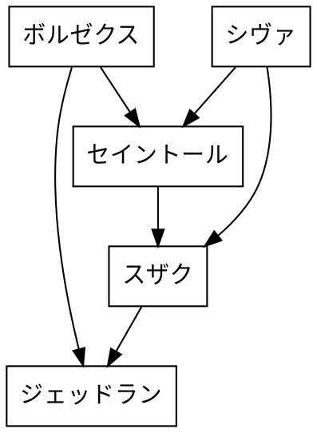

# パルワールド交配シミュレーター

パル交配のアルゴリズムと、例外を考慮している。
考慮漏れはあると思う。


## パルの交配

pとqを交配して生まれるパルを計算する。
また、pを固定して交配を続けたときに生まれるパルを計算している。


```
palpath dig -p ライバード -q ホウロック
```

example
```
start
step 0  ライバード      x       ホウロック      =       オコチョ
step 1  ライバード      x       オコチョ        =       ニャンギマリ
step 2  ライバード      x       ニャンギマリ    =       サラブレイズ
step 3  ライバード      x       サラブレイズ    =       ブリザモス
step 4  ライバード      x       ブリザモス      =       リリクイン
step 5  ライバード      x       リリクイン      =       フロスカノン
step 6  ライバード      x       フロスカノン    =       ライバード
end
```

## オスのパルとメスのパルリストからターゲットのパルを生成するまでのパスをgraphvizのdot形式で出力する

```
palpath tree -m シヴァ -f ボルゼクス  -t ジェッドラン
```




## パルの親の組み合わせを表示


```sh
palpath pattern -n ジオラーヴァ
```

```
ルナクイン              ツンドラー
ルナクイン              グレイシャドウ
ルナクイン              グレイシャル
ルナクイン              ジェッドラン
ルナクイン              セイントール
ツンドラー              エレパンダ
ツンドラー              ヘルガルダ
クインビーナ            ボルカイザー
アグニドラ              ボルカイザー
ボルゼクス              エレパンダ
ボルゼクス              ヘルガルダ
ボルゼクス              ジオラーヴァ
エレパンダ              グレイシャドウ
エレパンダ              グレイシャル
エレパンダ              ジェッドラン
グレイシャドウ          ヘルガルダ
グレイシャドウ          サラブラック
グレイシャドウ          フロスカノン
グレイシャドウ          ライバード
グレイシャル            ライバード
ゼノグリフ              パリピドン
ゼノグリフ              リリクイン
ゼノグリフ              サラブラック
ゼノグリフ              フロスカノン
ゼノグリフ              デスティング
ゼノグリフ              ペコドン
パリピドン              スザク
パリピドン              ベイントール
パリピドン              シヴァ
スザク                  リリクイン
スザク                  サラブラック
スザク                  デスティング
スザク                  ペコドン
スザク                  ブリザモス
ヘルガルダ              ジオラーヴァ
リリクイン              ベイントール
リリクイン              ジェッドラン
リリクイン              セイントール
サラブラック            ベイントール
サラブラック            ジェッドラン
サラブラック            セイントール
ベイントール            フロスカノン
ベイントール            デスティング
ベイントール            ライバード
シヴァ                  デスティング
シヴァ                  ペコドン
シヴァ                  ブリザモス
シヴァ                  レヴィドラ
シヴァ                  グランモス
フロスカノン            ジェッドラン
フロスカノン            セイントール
デスティング            セイントール
ペコドン                ボルカイザー
ジェッドラン            ライバード
ボルカイザー            ブリザモス
ボルカイザー            レヴィドラ
ボルカイザー            ボルカノン
ボルカイザー            グランモス
セイントール            ライバード

```


## 全種類のパルを生成するパルのSet

```
palpath info compact
```


```
s_compact: {"チリザード", "サラブラック", "ボルカイザー", "ヘルゴート", "チョロゾウ", "イバラヒメ", "ツンドラー", "シャーマンダー", "ゴクエンオ", "シンエンオ", "ジェッドラン", "ニャオテト", "ゼノグリフ", "タマコッコ"}
```


## インストール

cargo install --path .

